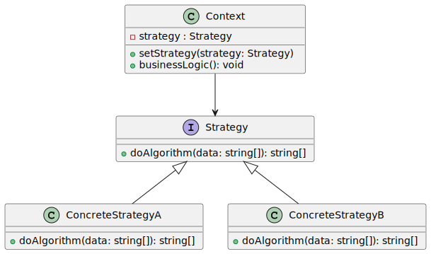

# Strategy

Strategy is a behavioral design pattern that lets you define a family of algorithms, put each of them into a separate class, and make their objects interchangeable.

## Real-world Analogy

Imagine that you have to get to the airport. You can catch a bus, order a cab, or get on your bicycle. These are your transportation strategies. You can pick one of the strategies depending on factors such as budget or time constraints.

Content extracted from https://refactoring.guru/design-patterns/strategy

UML generated by https://tsuml-demo.firebaseapp.com/

